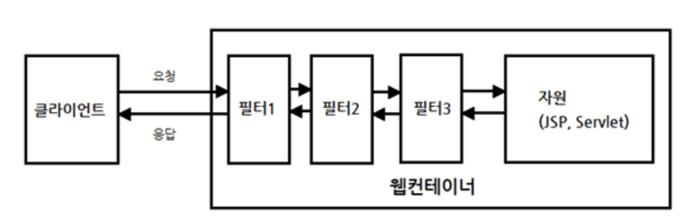
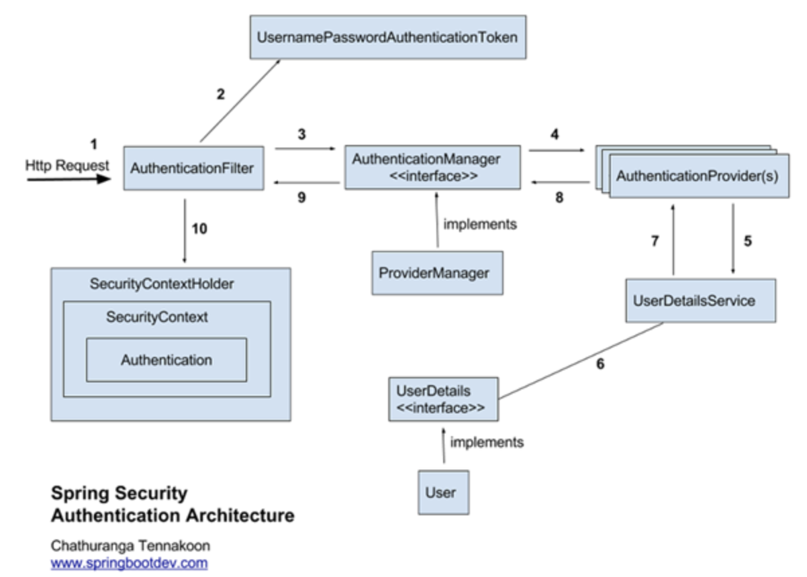

#### 최초 작성일 : 2021.08.25(수)

# Boostcourse Java Back-end 과정 학습

여기서는 Boostcourse Spring Framework Security 학습을 진행한다.

## 학습 환경

1. OS : MacOS
2. JDK : OpenJDK 11.0.5
4. Build Tools : Maven
5. Database : MySQL
6. IDE: IntelliJ IDEA Ultimate

## IntelliJ Spring Framework 프로젝트 설정 방법

### Maven 프로젝트 설정

1. IntelliJ에서 New Project 선택
   
2. `Maven` 선택, `org.apache.maven.archetypes:maven-archetype-webapp` 선택 후 Next 버튼 클릭
   
3. `GroupId`, `ArtifactId`, `Version` 설정 후 Next 버튼 클릭
   
    - GroupId는 보통 프로젝트를 진행하는 회사나 팀의 도메인 이름을 거꾸로 적는다.
    - ArtifactId는 해당 프로젝트의 이름을 적는다.
    - Version은 보통 기본값(1.0-SNAPSHOT)으로 설정한다.
    - 여기서는 언급되지 않지만 `Package`라는 것이 있는데, 이는 GroupId와 ActifactId가 조합된 형태를 가진다.
4. Finish 버튼 클릭
   

### Spring Framework 프로젝트로 변경

1. 프로젝트 `우클릭 > Add Framework Support...` 클릭
   
2. Spring MVC 선택 > Configure... 클릭
   
3. Configure 확인 후 OK
    - 스프링 버전인 이후에 Maven를 사용하여 알맞게 변경할 것이기 때문에 크게 신경쓸 필요 없다.
      
4. `lib` 폴더 삭제
    - Maven 빌드 도구를 이용하여 라이브러리를 사용할 것이기 때문에 삭제한다.
      
5. File > Projecdt Structure... > Libraires에서 등록되어 있는 라이브러리 모두 삭제
   
6. `pom.xml` 내용 변경
    - Spring Framework 라이브러리 추가
    - Build 설정
   ```xml
   <?xml version="1.0" encoding="UTF-8"?>
   <project xmlns="http://maven.apache.org/POM/4.0.0"
            xmlns:xsi="http://www.w3.org/2001/XMLSchema-instance"
            xsi:schemaLocation="http://maven.apache.org/POM/4.0.0
                                http://maven.apache.org/xsd/maven-4.0.0.xsd">
       <modelVersion>4.0.0</modelVersion>
       <groupId>kr.or.connect</groupId>
       <artifactId>springmvc</artifactId>
       <version>1.0-SNAPSHOT</version>
       <packaging>war</packaging>
       <name>springmvc Maven Webapp</name>
       <url>http://www.example.com</url>
       <properties>
           <project.build.sourceEncoding>UTF-8</project.build.sourceEncoding>
           <maven.compiler.source>11</maven.compiler.source>
           <maven.compiler.target>11</maven.compiler.target>
           <spring-version>4.3.5.RELEASE</spring-version>
       </properties>
   
       <dependencies>
           <!-- Spring Framework 라이브러리 추가 -->
           <dependency>
               <groupId>org.springframework</groupId>
               <artifactId>spring-context</artifactId>
               <version>${spring-version}</version>
           </dependency>
   
           <!-- Spring MVC 라이브러리 추가 -->
           <dependency>
               <groupId>org.springframework</groupId>
               <artifactId>spring-webmvc</artifactId>
               <version>${spring-version}</version>
           </dependency>
   
           <!-- JUnit 테스트 라이브러리 추가 -->
           <dependency>
               <groupId>junit</groupId>
               <artifactId>junit</artifactId>
               <version>4.11</version>
               <scope>test</scope>
           </dependency>
       </dependencies>
   
       <build>
           <finalName>springmvc</finalName>
           <!-- lock down plugins versions to avoid using Maven defaults (may be moved to parent pom) -->
           <pluginManagement>
               <plugins>
                   <plugin>
                       <artifactId>maven-clean-plugin</artifactId>
                       <version>3.1.0</version>
                   </plugin>
                   <!-- see http://maven.apache.org/ref/current/maven-core/default-bindings.html#Plugin_bindings_for_war_packaging -->
                   <plugin>
                       <artifactId>maven-resources-plugin</artifactId>
                       <version>3.0.2</version>
                   </plugin>
                   <plugin>
                       <artifactId>maven-compiler-plugin</artifactId>
                       <version>3.8.0</version>
                   </plugin>
                   <plugin>
                       <artifactId>maven-surefire-plugin</artifactId>
                       <version>2.22.1</version>
                   </plugin>
                   <plugin>
                       <artifactId>maven-war-plugin</artifactId>
                       <version>3.2.2</version>
                   </plugin>
                   <plugin>
                       <artifactId>maven-install-plugin</artifactId>
                       <version>2.5.2</version>
                   </plugin>
                   <plugin>
                       <artifactId>maven-deploy-plugin</artifactId>
                       <version>2.8.2</version>
                   </plugin>
               </plugins>
           </pluginManagement>
       </build>
   </project>
   ```
7. web.xml 내용 변경
    - 여기서는 XML 설정 파일이 아닌 `Java Config 파일`을 통해 Spring 설정을 읽어 들이도록 설정하였음.
   ```xml
   <?xml version="1.0" encoding="UTF-8"?>
   <web-app xmlns="http://xmlns.jcp.org/xml/ns/javaee"
            xmlns:xsi="http://www.w3.org/2001/XMLSchema-instance"
            xsi:schemaLocation="http://xmlns.jcp.org/xml/ns/javaee
                                http://xmlns.jcp.org/xml/ns/javaee/web-app_3_1.xsd"
            version="3.1">
   
       <display-name>Spring Web Java Config</display-name>
   
       <context-param>
           <param-name>contextClass</param-name>
           <param-value>org.springframework.web.context.support.AnnotationConfigWebApplicationContext</param-value>
       </context-param>
       <context-param>
           <param-name>contextConfigLocation</param-name>
           <!-- ContextLoaderListener가 읽어들일 설정 파일 -->
           <param-value>kr.or.connect.springmvc.ApplicationConfig</param-value>
       </context-param>
       <!-- listener: 특정한 이벤트가 일어났을때 동작 -->
       <listener>
           <!-- 컨텍스트가 로딩될 때 ContextLoaderListener를 실행시킨다. -->
           <listener-class>org.springframework.web.context.ContextLoaderListener</listener-class>
       </listener>
   
       <!-- DispatcherServlet을 FrontController로 등록 -->
       <servlet>
           <servlet-name>mvc</servlet-name>
           <servlet-class>org.springframework.web.servlet.DispatcherServlet</servlet-class>
           <!-- DispatcherServlet이 실행될 때 AnnotationConfigWebApplicationContext을 이용하도록 설정 -->
           <init-param>
               <param-name>contextClass</param-name>
               <param-value>org.springframework.web.context.support.AnnotationConfigWebApplicationContext</param-value>
           </init-param>
           <!-- DispatcherServlet이 실행될 때 WebMvcContextConfiguration 설정 파일을 읽어 들여서 처리하도록 설정 -->
           <init-param>
               <param-name>contextConfigLocation</param-name>
               <param-value>kr.or.connect.springmvc.WebMvcContextConfiguration</param-value>
           </init-param>
           <load-on-startup>1</load-on-startup>
       </servlet>
       <servlet-mapping>
           <servlet-name>mvc</servlet-name>
           <url-pattern>/</url-pattern>
       </servlet-mapping>
   
       <!-- 스프링이 제공하는 CharacterEncodingFilter 등록(한글 처리)  -->
       <filter>
           <filter-name>encodingFilter</filter-name>
           <filter-class>org.springframework.web.filter.CharacterEncodingFilter</filter-class>
           <init-param>
               <param-name>encoding</param-name>
               <param-value>UTF-8</param-value>
           </init-param>
       </filter>
       <filter-mapping>
           <filter-name>encodingFilter</filter-name>
           <url-pattern>/*</url-pattern>
       </filter-mapping>
   
   </web-app>
   ```

### WAS(Tomcat 8.5) 설정

1. IntelliJ `우측 상단 Add Configuration...` 클릭
   
2. `+ 버튼 > Tomcat Server > Local`을 선택하여 톰캣 설정
   
3. Deployment, Application context 설정
   

## 상태유지기술(Cookie & Session)

1. HTTP프로토콜은 상태 유지가 안되는 프로토콜이다.
    - 즉, 이전에 무엇을 했고, 지금 무엇을 했는지에 대한 정보를 갖고 있지 않는다.
    - 웹 브라우저(클라이언트)의 요청에 대한 응답을 하고 나면 해당 클라이언트와의 연결을 지속하지 않는다.
2. 상태 유지를 위해 `Cookie`와 `Session` 기술이 등장했다.
    - 쿠키(Cookie)
        - 사용자 컴퓨터에 저장한다.
        - 저장된 정보를 다른 사람 또는 시스템이 볼 수 있는 단점이 있다.
        - 유효시간이 지나면 사라진다.
        - 아래 그림은 쿠키가 동작하는 방식이다.
          
          
    - 세션(Session)
        - 서버에 저장한다.
        - 서버가 종료되거나 유효시간이 지나면 사라진다.
        - 아래 그림은 세션이 동작하는 방식이다.
          
          

### 쿠키(Cookie)

1. 클라이언트단에 저장되는 작은 정보의 단위이다.
2. 클라이언트에서 생성하고 저장될 수 있고, 서버 단에서 전송한 쿠키가 클라이언트에 저장될 수 있다.
    - 서버에서 클라이언트의 브라우저로 전송되어 사용자의 컴퓨터에 저장한다.
    - 저장된 쿠키는 다시 해당하는 웹 페이지에 접속할 때, 브라우저에서 서버로 쿠키를 전송한다.
    - 쿠키는 `이름(name)과 값(value) 쌍으로 정보를 저장`한다.
    - 이름-값 쌍 외에도 도메인(Domain), 경로(Path), 유효기간(Max-Age, Expires), 보안(Secure), HttpOnly 속성을 저장할 수 있다.

#### javax.servlet.http.Cookie

|리턴 타입|메소드|설명|
|:----:|:----|:----|
|int|getMaxAge()|쿠키의 최대 지속 시간을 `초 단위`로 지정(`-1`로 설정한 경우 브라우저가 종료되면 해당 쿠키는 만료됨)|
|String|getName()|쿠키의 이름을 String 타입으로 반환|
|String|getValue()|쿠키의 값을 String 타입으로 반환|
|void|setValue(String newValue)|쿠키에 새로운 값을 설정할 때 사용|

1. 서버에서 쿠키 생성, `response의 addCookie()` 메소드를 이용해 클라이언트에게 전송
   ```java
   Cookie cookie = new Cookie(이름, 값);
   response.addCookie(cookie);
   ```
    - 쿠키는 (이름, 값)의 쌍 정보를 입력하여 생성한다.
        - 쿠키의 이름은 일반적으로 알파벳과 숫자, 언더바(_)로 구성한다.
            - 정확한 정의를 알고 싶다면 RFC 6265(https://tools.ietf.org/html/rfc6265) 문서 [4.1.1 Syntax] 항목 참조
    - 쿠키는 그 수와 크기에 제한
        - 한 쿠키의 크기는 4Kbyte로 제한
        - 브라우저는 각각의 웹사이트 당 20개의 쿠키를 허용
        - 모든 웹 사이트를 합쳐서 최대 300개를 허용
            - 즉, 클라이언트 당 쿠키의 최대 용량은 1.2Mbyte
2. 클라이언트가 보낸 쿠키 정보 읽기
   ```java
   Cookie[] cookies = request.getCookies();
   ```
    - 쿠키 값이 없으면 NULL이 반환된다.
    - 쿠키가 가지고 있는 `getName()과 getValue()` 메소드를 이용해서 원하는 쿠키 정보를 찾아 사용하면 된다.
3. 클라이언트에게 쿠키 삭제 요청
   ```java
   Cookie cookie = new Cookie("이름", null);
   cookie.setMaxAge(0);
   response.addCookie(cookie);
   ```
    - 쿠키를 삭제하는 명령은 없고, `maxAge가 0인 같은 이름의 쿠키를 전송`한다.
4. 쿠키의 유효기간 설정
    - `setMaxAge()`
        - 인자는 유효기간을 나타내는 `초 단위의 정수형`
        - 만일 유효기간을 0으로 지정하면 쿠키의 삭제
        - 음수를 지정하면 브라우저가 종료될 때 쿠키가 삭제
    - 유효기간을 10분으로 지정하려면
        - `cookie.setMaxAge(10 * 60)` //초 단위: 10분
        - 1주일로 지정하려면 (7 * 24 * 60 * 60)로 설정

#### Spring MVC에서 Cookie 사용

1. `@CookieValue` 어노테이션 사용
    - 컨트롤러 메소드의 파라미터에서 `@CookieValue`을 사용함으로써 원하는 쿠키정보를 파라미터 변수에 담아 사용할 수 있다.
        - 컨트롤러 메소드(@CookieValue(value="쿠키이름", required=false, defaultValue="기본값") String 변수명)
      ```java
      @Controller
      public class CookieController {

          @GetMapping("/cookies")
          public String getCookiesView(@CookieValue(value = "name", required = false, defaultValue = "홍길동") String name) {
              System.out.println("Cookie name = " + name);
      
              return "cookies";
          } 
      }
      ```

### 세션(Session)

1. 클라이언트 별로 서버에 저장되는 정보이다.
    - 웹 클라이언트가 서버측에 요청을 보내게 되면 `서버는 클라이언트를 식별하는 session id를 생성`한다.
    - 서버는 session id를 이용해서 key와 value를 이용한 저장소인 `HttpSession을 생성`한다.
    - 서버는 session id를 저장하고 있는 쿠키를 생성하여 클라이언트에 전송한다.
    - 클라이언트는 서버측에 요청을 보낼때 session id를 가지고 있는 쿠키를 전송한다.
    - 서버는 쿠키에 있는 session id를 이용해서 그 전 요청에서 생성한 HttpSession을 찾고 사용한다.

#### javax.servlet.http.HttpSession

|리턴 타입|메소드|설명|
|:----:|:----|:----|
|long|getCreationTime()|세션이 생성된 시간부터 지난 시간을 계산하여 밀리센컨드로 반환|
|String|getId()|세션에 할당된 유일한 식별자(ID)를 String 타입으로 반환|
|int||getMaxInactiveInterval()|현재 생성된 세션을 유지하기 위해 설정된 최대 시간을 초의 정수형으로 반환(지정하지 않으면 기본 값은 1800초(30분), 하지만 서버 설정에 따라 달라질 수 있음)|
|Object|getAttribute(String name)|name이란 이름에 해당되는 속성 값을 Object 타입으로 반환(만약, 없을 경우 NULL을 반환함)|
|Enumeration|getAttributeNames()|속성의 이름들을 Enumeration 타입으로 반환|
|void|invalidate()|현재 생성된 세션을 무효화 시킴|
|void|removeAttribute(String name)|name으로 지정한 속성의 값을 제거|
|void|setAttribute(String name, Object value)|name으로 지정한 이름에 value 값을 설정|
|void|setMaxInactiveInterval(int interval)|세션의 최대 유지 시간을 초 단위로 설정|
|boolean|isNew()|세션이 새로 만들어졌으면 true, 이미 만들어진 세션이면 false를 반환|

1. 세션 생성 및 얻기
   ```java
   HttpSession session = request.getSession();
   HttpSession session = request.getSession(true);
   HttpSession session = request.getSession(false);
   ```
    - `request의 getSession()` 메소드는 서버에 생성된 세션이 있다면 세션을 반환하고, 없다면 새롭게 세션을 생성하여 반환한다.
    - 새롭게 생성된 세션인지는 HttpSession이 가지고 있는 `isNew()` 메소드를 통해 알 수 있다.
    - request의 getSession()메소드에 파라미터로 `false`를 전달하면 `이미 생성된 세션이 있다면 반환하고, 없으면 NULL을 반환`한다.
        - `파라미터 생략시 기본은 true`
2. 세션에 값 저장
   ```java
   session.setAttribute(String name, Object value); //setAttribute(이름, 값)
   ```
    - `HttpSession의 setAttribute()` 메소드는 `name과 value의 쌍`으로 객체(Object)를 저장하는 메소드이다.
    - 세션이 유지되는 동안 저장할 자료를 저장한다.
3. 세션에 값 조회
   ```java
   String value = (String) session.getAttribute("id"); //getAttribute(이름)
   ```
    - 세션에 저장된 자료는 다시 `HttpSession의 getAttribute(String name)` 메소드를 이용해 조회한다.
        - 이때 name은 setAttribute(String name, Object value) 메소드에 이용한 name
    - 반환 값은 Object 유형이므로 저장된 객체로 타입 변환이 필요하다.
4. 세션 값 삭제
   ```java
   session.removeAttribute(String name); //removeAttribute(이름)
   ```
    - name값에 해당하는 세션 정보를 삭제한다.
    - 참고로 `HttpSession의 invalidate()` 메소드도 있는데, 이는 모든 세션 정보를 삭제한다.

#### web.xml에 세션 유지 시간 설정

1. 세션은 클라이언트가 서버에 접속하는 순간 생성된다.
2. 특별히 지정하지 않으면 세션의 유지 시간은 기본 30분으로 설정된다.
    - `세션의 유지 시간`이란 서버에 접속한 후 `서버에 요청을 하지 않는 최대 시간`을 말한다.
    - 30분 이상 서버에 전혀 반응을 보이지 않으면 세션이 자동으로 끊어진다.
3. 세션 유지 시간은 `web.xml` 파일에서 설정이 가능하다.
   ```xml
   <session-config>
      <session-timeout>30</session-timeout>
   </session-config>
   ```

#### Spring MVC에서 Session 사용

1. `@SessionAttributes`와 `@ModelAttribute`
    - @SessionAttributes 파라미터로 지정된 이름과 같은 이름이 @ModelAttribute에 지정되어 있을 경우 메소드가 반환하는 값은 세션에 저장된다.
      ```java
      @Controller
      @SessionAttributes("user")
      public class LoginController {
      
          @ModelAttribute("user")
          public User setUpUserForm() {
              //code ...
      
              return new User();
          }
      }
      ```
    - @SessionAttributes 파라미터로 지정된 이름과 같은 이름이 @ModelAttribute에 지정되어 있을 경우 세션에 있는 객체를 가져온 후 클라이언트로 전송받은 값을 설정한다.
      ```java
      @Controller
      @SessionAttributes("user")
      public class LoginController {
       
          @PostMapping("/dologin")
          public String doLogin(@ModelAttribute("user") User user, Model model) {
              //code ...
          }
      }
      ```
2. `@SessionAttribute`
    - 메소드에 @SessionAttribute가 있을 경우 파라미터로 지정된 이름으로 등록된 세션 정보를 읽어와서 변수에 할당한다.
       ```java
       @Controller
       public class MyController {
        
           @GetMapping("/info")
           public String userInfo(@SessionAttibute("user") User user) {
               //code ...
      
               return "user";
           }
       }
       ```
3. `SessionStatus`
    - SessionStatus는 컨트롤러 메소드의 파라미터로 사용할 수 있는 스프링 내장 타입이다.
        - org.springframework.web.bind.support.SessionStatus
    - `SessionStatus의 setComplete()` 메소드를 이용하면 현재 컨트롤러의 @SessionAttributes에 의해 저장된 오브젝트를 제거할 수 있다.
      ```java
      @Controller
      @SessionAttributes("user")
      public class UserController {
      
          @RequestMapping(value = "/user/add", method = RequestMethod.POST)
          public String submit(@ModelAttribute("user") User user, SessionStatus sessionStatus) {
              //code ...
      
              sessionStatus.setComplete();
          }
      }
      ```

## 스프링 시큐리티(Spring Security)

1. 스프링 기반의 어플리케이션의 보안을 담당하는 프레임워크를 말한다.
2. 스프링 시큐리티는 `필터(Filter)` 기반으로 동작하기 때문에 스프링 MVC 와 분리되어 관리 및 동작한다.
    - 스프링 시큐리티 3.2부터는 XML로 설정하지 않고, Java Config 설정으로 간단하게 설정할 수 있게 지원하고 있다.
3. 자주 사용하는 보안 용어
    - `접근 주체(Principal)` : 보호된 대상에 접근하는 유저
    - `인증(Authentication)` : 인증은 '증명하다'라는 의미로 예를 들어, 유저 아이디와 비밀번호를 이용하여 로그인 하는 과정을 말한다.
    - `인가(Authorization)` : '권한부여'나 '허가'와 같은 의미로 사용됩니다. 즉, 어떤 대상이 특정 목적을 실현하도록 허용(Access) 하는 것을 의미한다.
    - `권한` : 인증된 주체가 애플리케이션의 동작을 수행할 수 있도록 허락되었는지를 결정할 때 사용

### 스프링 시큐리티 필터(Spring Security Filter)



1. 클라이언트는 요청을 보내고, 그 요청을 서블릿이나 JSP 등이 처리한다.
2. `스프링 MVC`에서는 가장 먼저 요청을 받는 `DispatcherServlet`이 요청 받기 전에 다양한 필터들이 있을 수 있다.
    - 필터의 역할은 클라이언트와 자원 사이에서 요청과 응답 정보를 이용해 다양한 처리를 하는데 목적이 있다.
    - 어떤 필터는 요청을 받은 후, 클라이언트가 원래 요청한 자원이 아닌 다른 자원으로 리다이렉트 시킬 수도 있다.
    - 어떤 필터는 다음 필터에게 요청과 응답을 전달하지 않고, 바로 클라이언트에게 응답하고 끝낼 수도 있다.
3. 스프링 시큐리티에서는 다양한 기능을 가진 필터들을 10개 이상 기본적으로 제공하는데, 이렇게 제공되는 필터들을 `Security Filter Chain`이라고 한다.
   

#### SecurityContextPersistenceFilter

1. SecurityContextRepository에서 `SecurityContext`를 가져오거나 저장하는 역할을 한다.

#### LogoutFilter

1. 설정된 로그아웃 URL로 오는 요청을 감시하며, 해당 유저를 로그아웃 처리한다.

#### (UsernamePassword)AuthenticationFilter

1. 아이디와 비밀번호를 사용하는 FORM 기반 인증
2. 설정된 로그인 URL로 오는 요청을 감시하며, 유저 인증을 처리한다.
    - `AuthenticationManager`를 통한 인증 실행
    - 인증 성공 시, 얻은 Authentication 객체를 SecurityContext에 저장 후 AuthenticationSuccessHandler 실행
    - 인증 실패 시, AuthenticationFailureHandler 실행

#### DefaultLoginPageGeneratingFilter

1. 인증을 위한 로그인 FORM URL을 감시한다.

#### BasicAuthenticationFilter

1. HTTP 기본 인증 헤더를 감시하여 처리한다.

#### RequestCacheAwareFilter

1. 로그인 성공 후, 원래 요청 정보를 재구성하기 위해 사용된다.

#### SecurityContextHolderAwareRequestFilter

1. HttpServletRequestWrapper를 상속한 `SecurityContextHolderAwareRequestWrapper` 클래스로 HttpServletRequest 정보를 감싼다.
2. SecurityContextHolderAwareRequestWrapper 클래스는 필터 체인상의 다음 필터들에게 부가정보를 제공한다.

#### AnonymousAuthenticationFilter

1. 이 필터가 호출되는 시점까지 사용자 정보가 인증되지 않았다면 인증 토큰에 사용자가 익명 사용자로 나타난다.

#### SessionManagementFilter

1. 이 필터는 인증된 사용자와 관련된 모든 세션을 추적한다.

#### ExceptionTranslationFilter

1. 이 필터는 보호된 요청을 처리하는 중에 발생할 수 있는 예외를 위임하거나 전달하는 역할을 한다.

#### FilterSecurityInterceptor

1. 이 필터는 AccessDecisionManager 로 권한부여 처리를 위임함으로써 접근 제어 결정을 쉽게해준다.

### 스프링 시큐리티 인증관련 아키텍처

1. 아이디와 암호를 입력했을 때 이를 처리하는 필터는 `AuthenticationFilter`이다.
   

    - 클라이언트가 로그인을 시도한다.
    - AuthenticationFilter는 AuthenticationManager, AuthenticationProvider(s), UserDetailsService를 통해 DB에서 사용자 정보를 읽어온다.
        - 여기서 중요한 것은 `UserDetailsService가 인터페이스라는 것이다.`
        - 해당 인터페이스를 구현한 빈(Bean)을 생성하면 스프링 시큐리티는 해당 빈을 사용하게 된다.
            - 즉, 어떤 데이터베이스로 부터 읽어들일지 스프링 시큐리티를 이용하는 개발자가 결정할 수 있게 된다.
    - UserDetailsService는 로그인한 ID에 해당하는 정보를 DB에서 읽어들여 `UserDetails를 구현한 객체`로 반환한다.
        - 개발자는 UserDetails를 구현한 객체를 만들어야 할 필요가 있을 수 있다.
        - `UserDetails 정보를 세션에 저장`한다.
    - 스프링 시큐리티는 인메모리 세션저장소인 SecurityContextHolder에 UserDetails정보를 저장한다.
    - 클라이언트에게 Session ID(JSESSIONID)와 함께 응답을 한다.
    - 이후 요청에서는 요청 쿠키에서 JSESSIONID 정보를 통해 이미 로그인 정보가 저장되어 있는 지 확인한다.
    - 이미 저장되어 있고 유효하면 인증 처리 한다.
